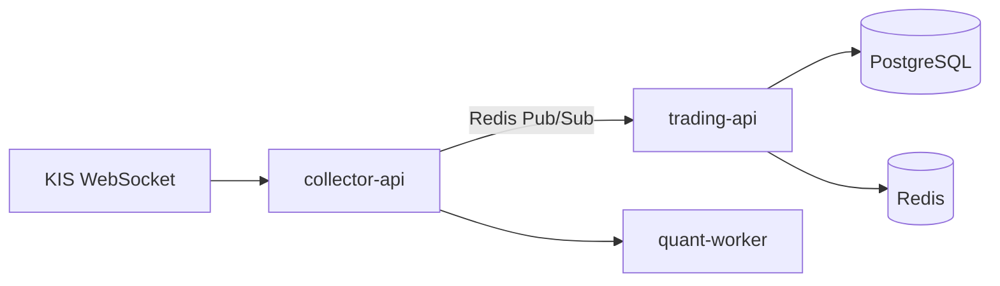
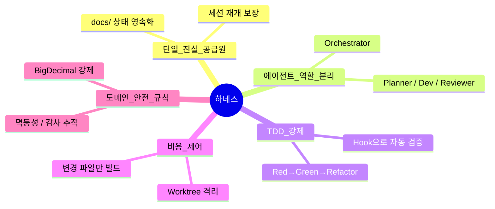
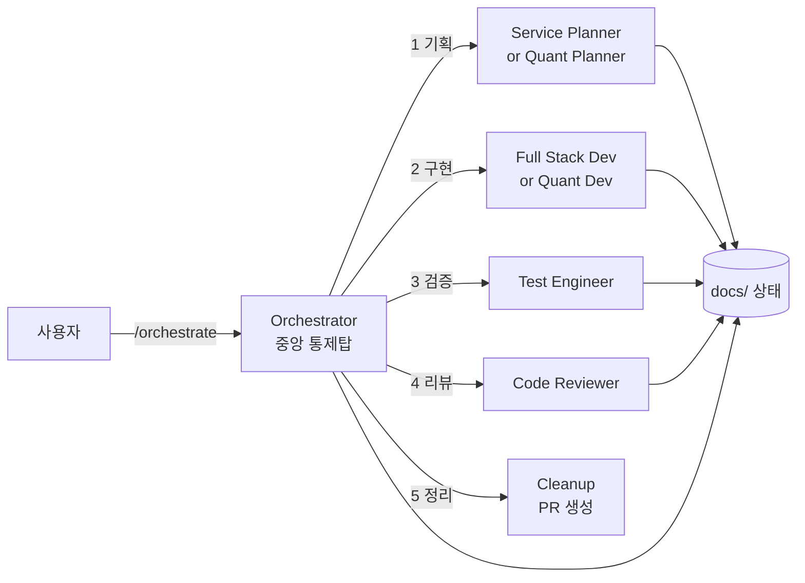
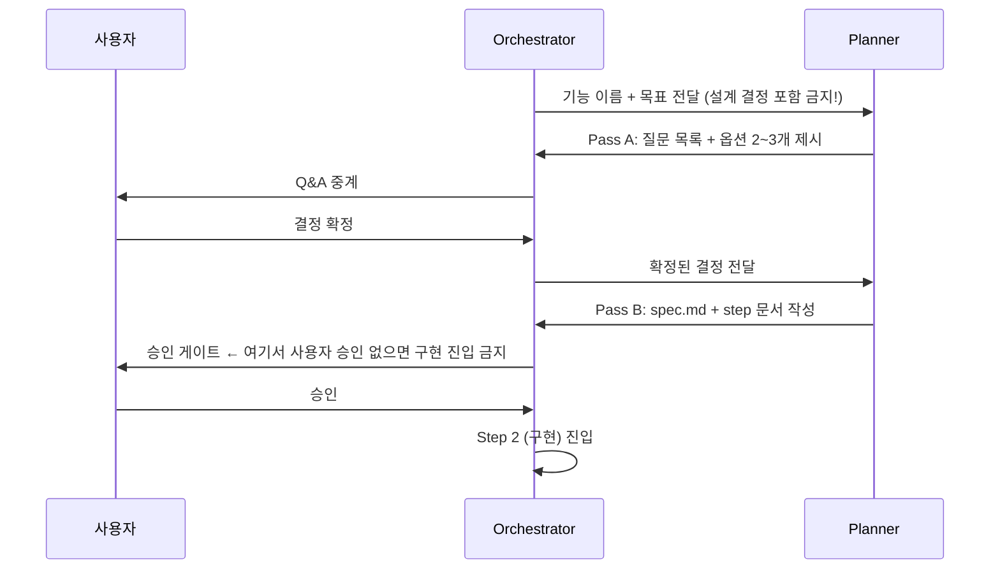
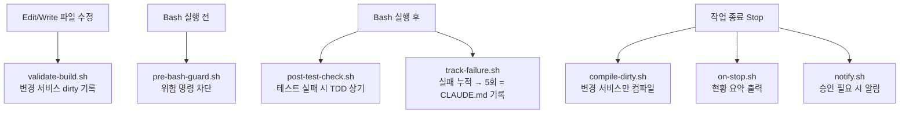
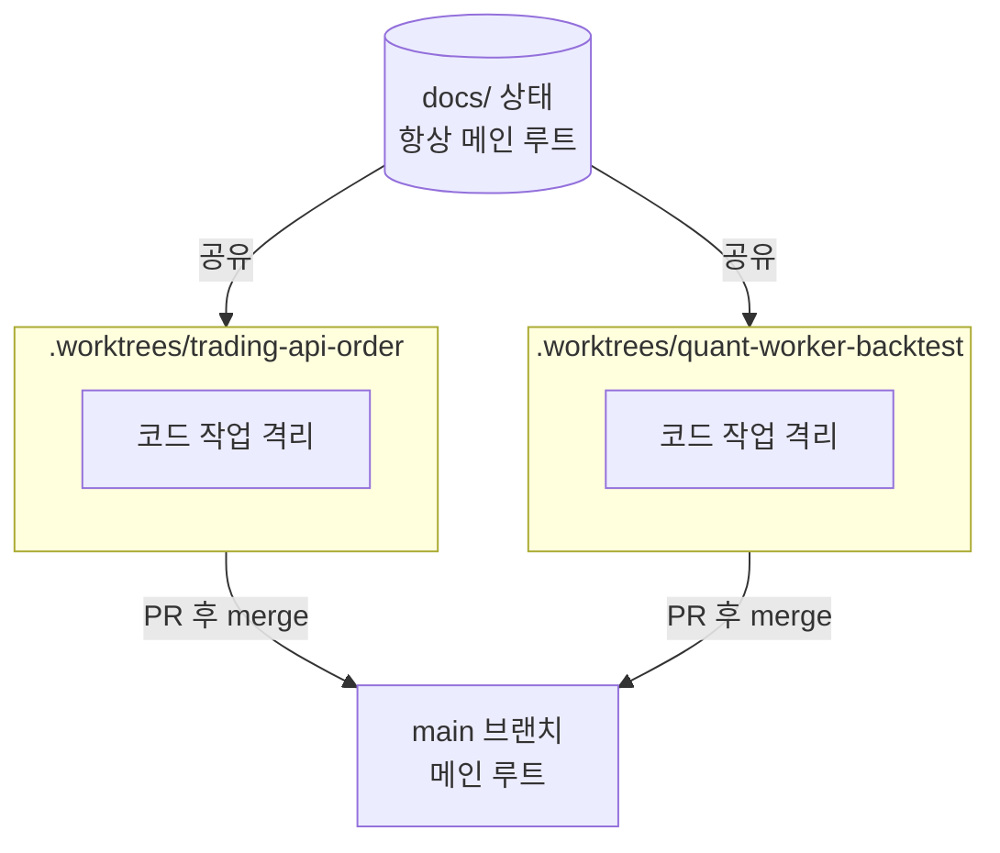
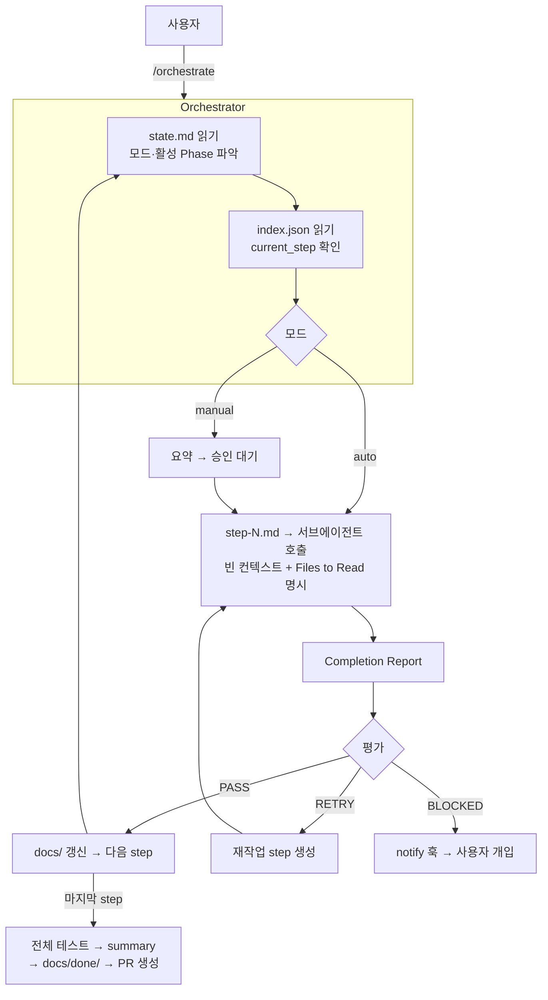
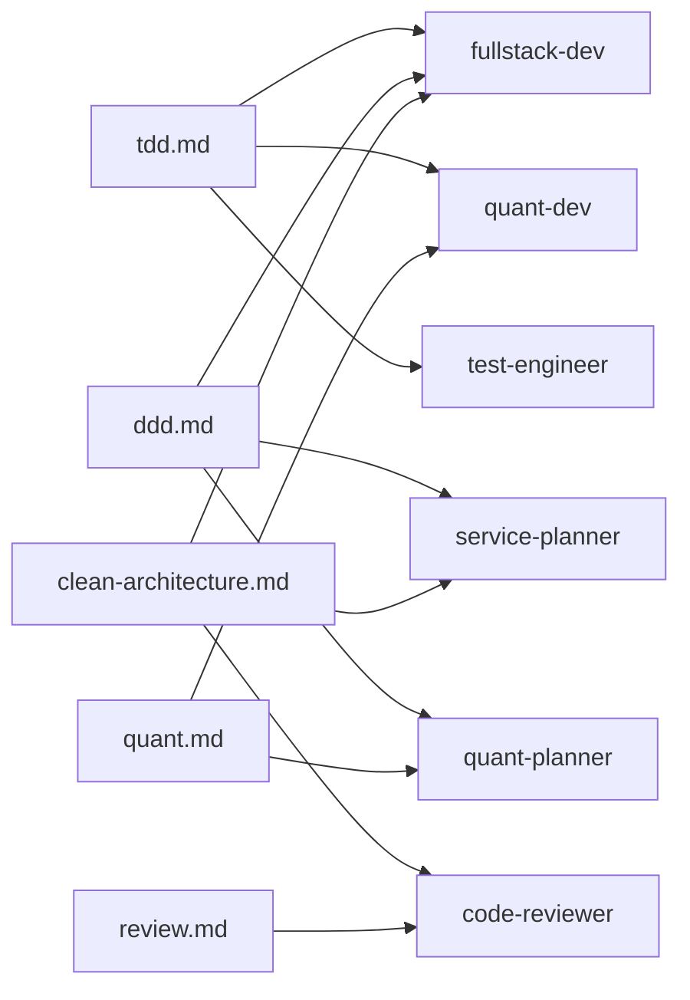

# 개인 하네스 엔지니어링 — 활용 및 구현 사례 분석

> **Paper Trading Platform**을 구축하며 AI 에이전트가 실제로 일하는 방식을 설계한 과정

---

## 0. 왜 이 발표를 하는가

> _"AI 코딩 어시스턴트를 쓴다"와 "AI가 내 팀원처럼 일한다"는 완전히 다른 이야기다._

단순히 Claude에게 코드를 물어보는 수준을 넘어서,  
**금융 시스템을 안전하게, 비용 효율적으로, 세션이 끊겨도 이어서 개발**할 수 있도록  
직접 하네스를 설계하고 운영한 경험을 공유합니다.

---

## 1. 배경 — 어떤 시스템을 만들었나

```
Paper Trading Platform
├── trading-api       (Kotlin/Spring Boot) — 주문·체결·정산·포지션
├── collector-api     (Kotlin/Spring Boot) — 실시간 시세 수집
├── quant-worker      (Python/FastAPI)     — 백테스팅·AI 퀀트 전략
└── trading-web       (React/TypeScript)   — 운영 대시보드
```

**데이터 흐름**



이 시스템에서 AI에게 코드를 맡기면 바로 등장하는 문제들이 있었습니다.

---

## 2. 문제 정의 — AI와 개발할 때 생기는 4가지 실제 문제

### 문제 1: 컨텍스트 소실
> 세션이 끊기면 AI는 지금까지 뭘 했는지 모른다.  
> "이어서 해줘"라고 해도 처음부터 다시 분석한다.

### 문제 2: 독단적 결정
> AI가 묻지 않고 DB 스키마, 클래스 구조, API 설계를 알아서 만든다.  
> 개발자와 AI의 의도가 어긋난 채로 구현이 쌓인다.

### 문제 3: 비용 폭증
> AI가 관련 없는 파일까지 읽고, 매번 전체 빌드를 돌리고,  
> 불필요한 서브에이전트를 남발한다.

### 문제 4: 금융 도메인 특유의 위험
> 실수 한 번 = 돈이 잘못 계산됨.  
> float 연산, 비멱등 주문 API, 상태 전이 누락은 치명적이다.

---

## 3. 해결 전략 — 5개 축



---

## 4. 구조 개요 — 하네스가 어떻게 생겼나

```
paper-trading/
├── CLAUDE.md                ← ★ 헌법 (모든 세션에 자동 주입)
│
├── .claude/
│   ├── settings.json        ← 훅 등록 + 권한 설정
│   ├── commands/            ← 슬래시 커맨드 (8개) — 얇은 라우터
│   ├── agents/              ← 에이전트 페르소나 (7개) — 역할 본체
│   ├── skills/              ← 공유 지식 모듈 (7개) — 재사용 지식
│   └── hooks/               ← 자동 개입 스크립트 (7개)
│
└── docs/                    ← ★ 오케스트레이터 상태 (단일 진실 공급원)
    ├── state.md
    ├── TODO.md
    ├── phase/{project}/{feature}/
    │   ├── index.json       ← 상태 머신
    │   ├── spec.md
    │   └── step-1..N.md    ← ★ Planner가 작성하는 단계별 기능 명세서
    └── done/                ← 완료 기능 아카이브
```

### `/build` 입력 한 번이 실제로 거치는 파일들

사용자가 `/build`를 입력하면 Claude는 파일 3단계를 순서대로 읽어 "무엇을, 어떻게 할지"를 조립한다.

**① 커맨드** — 진입점, 라우터 역할만 한다 (실제 파일 내용 전부)

```
# commands/build.md
담당 에이전트: Full Stack Developer — TDD 기반 구현
@../agents/fullstack-dev.md
```

**② 에이전트** — "이 역할이 어떻게 일하는지" 정의한다

```
# agents/fullstack-dev.md
Role: Full Stack Developer

@../skills/tdd.md               ← 스킬 끌어오기
@../skills/clean-architecture.md
@../skills/ddd.md

## Execution Order
1. step-{n}.md과 Files to Read 읽기
2. TDD 사이클 (Red → Green → Refactor)
3. 빌드 검증 후 완료 보고
...
```

**③ 스킬** — 여러 에이전트가 공유하는 도메인 지식

```
# skills/tdd.md
1. Red:    테스트 먼저 작성 → 실패 확인 (Green 진입 전 필수)
2. Green:  테스트를 통과하는 최소 구현만
3. Refactor: 중복 제거 → 재실행 확인
...
```

**왜 이렇게 나눴나 — 핵심은 중복 제거**

TDD 규칙을 바꾸고 싶으면 `skills/tdd.md` **한 파일**만 수정하면 된다.  
`fullstack-dev`, `quant-dev`, `test-engineer` 세 에이전트가 모두 이 파일을 `@import`해서 쓰기 때문에 자동으로 반영된다.

```
skills/tdd.md 수정 한 번
    → fullstack-dev 반영  ✓
    → quant-dev 반영      ✓
    → test-engineer 반영  ✓
```

---

## 5. 핵심 1 — 단일 진실 공급원 (SSOT)

### 문제
`.claude/docs`, `.codex/docs`, `worktree 내부 docs` 등  
AI 툴마다 자기 공간에 상태를 쓰기 시작하면 **어느 docs가 진짜인지 알 수 없어진다.**

### 해결
```
규칙: 오케스트레이터 상태는 오직 루트 docs/ 에만 존재한다.
      .claude/**/docs, .codex/**/docs — 절대 읽지도 쓰지도 않는다.
```

### 상태 구조

```json
// docs/phase/trading-api/order-feature/index.json
{
  "status": "in_progress",
  "current_step": 2,
  "branch": "feature/trading-api-order-feature",
  "worktree_path": ".worktrees/trading-api-order-feature",
  "steps": [
    { "id": 1, "agent": "service-planner", "status": "completed" },
    { "id": 2, "agent": "fullstack-dev",   "status": "in_progress",
      "substeps": [
        { "id": 1, "name": "Order Aggregate", "status": "completed" },
        { "id": 2, "name": "Account Aggregate", "status": "in_progress" }
      ]
    }
  ]
}
```

**효과**: 세션이 끊겨도, 툴이 바뀌어도, 장애가 나도 — `docs/` 만 있으면 정확히 재개된다.

---

## 6. 핵심 2 — 에이전트 역할 분리와 위임 경계

### 파이프라인 구조



### 핵심 설계 원칙

**오케스트레이터는 코드를 쓰지 않는다**  
오케스트레이터는 `docs/state.md`와 `index.json`을 읽어 _누구를 부를지_ 결정하고,  
결과를 평가해 PASS / RETRY / BLOCKED를 판단한다.

**서브에이전트는 빈 컨텍스트로 시작한다**  
컨텍스트 격리로 비용을 줄이는 대신, step 문서에 "읽을 파일"을 전부 명시해야 한다.

```markdown
## Files to Read
- CLAUDE.md
- docs/ADR.md
- docs/phase/trading-api/order-feature/spec.md
- backend/trading-api/src/main/kotlin/...Order.kt
```

**슬래시 커맨드는 Agent 도구로만 위임한다 (Skill 인라인 실행 금지)**

```
✅ 올바른 방식: Agent(description="...", prompt="...")
❌ 금지:        Skill("build", ...) 인라인 실행
```

이유: Skill을 직접 실행하면 메인 에이전트 컨텍스트를 소모하고 제어 흐름 추론이 불가능해진다.

---

## 7. 핵심 3 — 2-pass 기획 + 승인 게이트

### 문제
AI에게 "주문 기능 만들어줘"라고 하면, AI가 알아서 DB 스키마를 결정하고 구현해버린다.  
개발자는 나중에 완성된 코드를 보고서야 "이게 아닌데…"를 깨닫는다.

### 해결: 2-pass 패턴



**Pass B 산출물 — step-N.md가 곧 기능 명세서**

Planner가 Pass B에서 작성하는 `step-N.md`는 구현 에이전트(Dev)에게 넘기는 단계별 기능 명세서다.  
Dev는 이 파일만 읽고 무엇을 구현할지 파악한다 — 구두 지시 없음, 해석 여지 없음.

```markdown
## step-2.md (Planner 작성 예시)

### Goal
Order Aggregate 구현 — 주문 생성·체결·취소 상태 전이

### Files to Read
- CLAUDE.md
- docs/phase/trading-api/order-feature/spec.md
- src/main/kotlin/domain/order/Order.kt

### Tasks
1. Order 엔티티 — 상태 전이 메서드 (place / fill / cancel)
2. OrderRepository 인터페이스
3. OrderService — 주문 생성 유스케이스

### Acceptance Criteria
- 주문 생성 시 PENDING → PLACED 전이 테스트 Green
- 체결 시 PLACED → FILLED 전이 테스트 Green
- float/double 사용 금지, BigDecimal만 허용
```

> **핵심**: AI 해석과 사용자 의도를 구현 전에 정렬한다.  
> 기획자에게 설계 답을 미리 주면 질문 단계를 건너뛰어 2-pass 패턴이 깨진다.

---

## 8. 핵심 4 — TDD + Hook 강제

### 문제
AI에게 "TDD로 해줘"라고 해도, 테스트를 나중에 쓰거나 Red를 확인 안 하고 넘어간다.

### 해결: Hook으로 물리적 강제



**post-test-check.sh 출력 예시**
```
🔴 [TDD] 테스트 실패 — Red 단계 확인
→ 의도된 Red면 정상. Green(최소 구현)으로 진행.
→ 의도치 않은 실패면 원인 파악 후 진행.
```

**track-failure.sh — 자가 학습 루프**
```
실패 명령 → 로컬 LLM 분류 → failure-log.json 누적
→ 같은 카테고리 5회 도달 → CLAUDE.md 반복 장애 패턴에 자동 기록
```
> 같은 실수가 반복되면 "프로젝트 헌법"에 박제되어 다음 세션부터 사전 경고된다.

**에러 처리 매트릭스**

| 실패 유형 | 1차 | 2차 | 3차(한계) |
|-----------|-----|-----|-----------|
| 테스트 실패 | 자가 수정 1회 | dev 재작업 step | blocked → 사용자 |
| 리뷰 🔴 항목 | dev 재작업 | 2차 리뷰 | blocked → 사용자 |
| 빌드 실패 | 즉시 수정 | 재작업 step | blocked → 사용자 |
| **같은 step 3회 실패** | — | — | **blocked → 사용자 개입** |

---

## 9. 핵심 5 — Git Worktree로 동시 개발 격리

### 문제
여러 기능을 동시에 개발하면 코드 충돌이 발생한다.  
AI 에이전트들이 같은 파일을 동시에 수정하면 더 심각해진다.

### 해결

```bash
# Phase 시작 — 기능별 격리 브랜치
git worktree add .worktrees/trading-api-order-feature \
  -b feature/trading-api-order-feature

# PR 완료 후 정리
git worktree remove .worktrees/trading-api-order-feature
```



> **코드는 worktree 안에서만, 문서(docs/)는 절대 worktree 안에 쓰지 않는다.**

---

## 10. 핵심 6 — 금융 도메인 특화 안전 규칙

모의투자 시스템은 데이터 정합성 오류가 곧 금전적 피해다.  
일반 CRUD 서비스와 다른 차원의 강제 규칙이 필요했다.

### CLAUDE.md에 CRITICAL로 명시한 규칙들

| 위험 | 규칙 | 이유 |
|------|------|------|
| 부동소수점 계산 오차 | `BigDecimal`(Kotlin) / `Decimal`(Python) 강제, float/double 금지 | 0.1 + 0.2 ≠ 0.3 |
| 중복 주문 | 모든 주문 실행 흐름은 멱등성 보장 | 네트워크 재시도 시 이중 체결 방지 |
| 상태 전이 누락 | Order/Execution/Settlement 상태 전이 명시적 | 암묵적 변이 = 감사 불가 |
| 감사 불가 | 모든 금융 상태 변경은 이벤트 추적 가능해야 함 | 규제 요건 + 장애 추적 |
| 룩어헤드 편향 | 백테스트에서 미래 데이터 사용 금지 | 과대 수익률 착각 방지 |

### TDD 규칙과 금융 안전의 결합

```kotlin
// ❌ 금지 — float 연산
val profit = quantity * (exitPrice - entryPrice)

// ✅ 강제 — BigDecimal
val profit = quantity.multiply(exitPrice.subtract(entryPrice))
```

```python
# ❌ 금지
return float(shares) * float(price)

# ✅ 강제
from decimal import Decimal
return Decimal(str(shares)) * Decimal(str(price))
```

---

## 11. 전체 오케스트레이션 흐름



---

## 12. 비용 제어 전략

> **토큰은 엔지니어링 제약이다.**

| 낭비 유형 | 제어 방법 |
|-----------|-----------|
| AI가 관련 없는 파일까지 읽음 | step 문서에 "읽을 파일만" 명시, CLAUDE.md에 "명시된 파일만 읽기" 강제 |
| 매 수정마다 전체 빌드 실행 | validate-build가 dirty 목록 누적 → Stop 시 변경 서비스만 1회 컴파일 |
| 서브에이전트 남발 | Subagent Cost Control 섹션 — 쓰기 범위 안 겹칠 때만 병렬화 |
| 전체 테스트 스위트 반복 실행 | 구현/테스트 단계는 해당 파일 테스트만, 전체는 PR(cleanup) 단계 1회만 |
| 중복 기획자/리뷰어 스폰 | 설계 변경 없으면 재스폰 금지 |

---

## 13. 스킬 공유 구조 — 지식 중복 제거



> TDD 규칙을 바꾸면 `tdd.md` 한 파일만 고치면 된다.  
> 3개 에이전트(fullstack-dev, quant-dev, test-engineer)에 즉시 반영된다.

---

## 14. 배운 것들 — 핵심 인사이트 5가지

### ① "AI가 알아서 하겠지"를 믿지 마라
> 설계 단계에서 2-pass + 승인 게이트가 없으면, AI는 독단적으로 결정하고 개발자는 사후 수정에 시간을 쓴다.

### ② 상태 영속화는 선택이 아니라 필수
> 세션이 끊기는 것은 예외가 아니라 정상이다.  
> `docs/`에 매 step마다 상태를 쓰지 않으면, 재개할 방법이 없다.

### ③ Hook은 "규칙을 기억하게" 하는 것이 아니라 "물리적으로 강제"하는 것
> "TDD 해줘"는 잊힌다. `post-test-check.sh`는 잊히지 않는다.  
> `track-failure.sh`의 5회 누적 → CLAUDE.md 자동 기록은 자가 학습 루프다.

### ④ 도메인 특성을 CLAUDE.md에 CRITICAL로 박아야 한다
> 금융 시스템의 BigDecimal, 멱등성, 상태 전이는 "보통 규칙"이 아니라 "위반 시 치명적 규칙"이다.  
> CRITICAL 레이블과 예외 없는 단어("Never", "Must", "Always")를 써야 AI가 건너뛰지 않는다.

### ⑤ 에이전트 역할 경계가 곧 컨텍스트 비용 경계
> 오케스트레이터가 직접 코드를 짜기 시작하면 컨텍스트가 오염되고 비용이 폭증한다.  
> 오케스트레이터 = 상태 읽기·판단·위임만. 코드는 서브에이전트에게.

---

## 15. 한 문장 요약

> **사용자는 `/orchestrate`를 부르고 의사결정만 한다.**  
> **오케스트레이터가 `docs/` 상태를 읽어 기획→구현→테스트→리뷰→정리 서브에이전트를 차례로 호출하고,**  
> **훅이 안전·검증·알림을 자동 처리하며,**  
> **세션이 끊겨도 `docs/`만 있으면 정확히 이어서 재개된다.**

---

## 부록 A. 전체 구성 요소 한눈에

| 구성 요소 | 수 | 역할 |
|-----------|---|------|
| CLAUDE.md | 1 | 헌법 — 모든 세션에 자동 주입 |
| commands/ | 8 | 슬래시 커맨드 라우터 |
| agents/ | 7 | 에이전트 페르소나 |
| skills/ | 7 | 공유 도메인 지식 모듈 |
| hooks/ | 7 | 자동 안전·검증·알림 스크립트 |
| docs/state.md | 1 | 현재 모드·상태 |
| docs/phase/**/index.json | N | 기능별 상태 머신 |

## 부록 B. 문제 → 해법 대응표

| 문제 | 하네스의 해법 |
|------|-------------|
| AI가 컨텍스트를 잃으면 맥락이 사라짐 | docs/ 상태 영속화 → 세션 끊겨도 재개 |
| AI가 독단적으로 설계를 결정 | 2-pass 기획 + 승인 게이트 |
| AI가 위험한 명령을 실행 | pre-bash-guard 훅이 물리적 차단 |
| AI가 너무 많은 파일을 읽어 비용 폭증 | step 문서에 읽을 파일만 명시 |
| 매 수정마다 전체 빌드 → 느림 | dirty 목록에 모아 Stop 시 1회만 컴파일 |
| 같은 장애가 반복되는데 학습 안 됨 | track-failure 5회 → CLAUDE.md 자동 기록 |
| 금융 계산 실수 = 치명적 | BigDecimal/Decimal 전역 강제 |
| 여러 기능 동시 개발 시 코드 충돌 | Git Worktree로 기능별 격리 |
| AI와 개발자 의도 불일치 | 2-pass 기획 + docs에 모든 결정 기록 |
